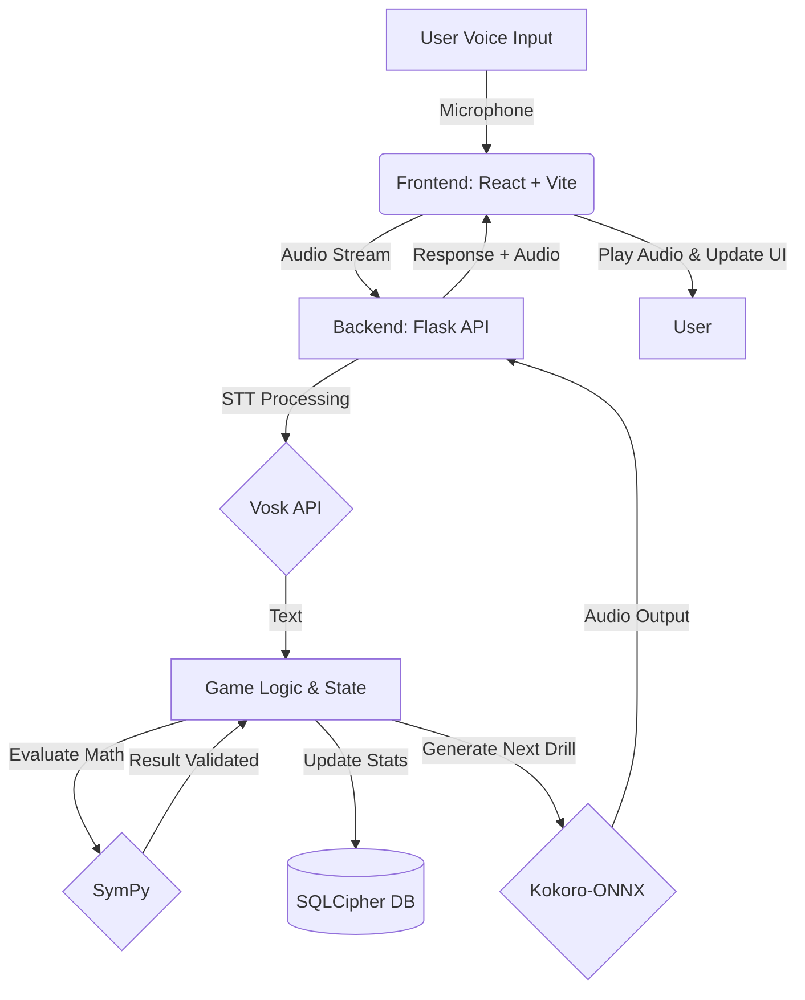

# Project Gwen Architecture

## System Diagram
The architecture of Project Gwen is designed around a fully local, offline-first approach, prioritizing zero-latency processing and strict user data privacy.

## Data Flow
1. **Input:** The user speaks an answer to a mental math drill.
2. **STT:** The frontend captures the audio and sends it to the local Flask backend. The backend uses the **Vosk API** to transcribe the audio into text offline.
3. **Evaluation:** The transcribed text is validated. The backend uses **SymPy** to securely evaluate the generated math expressions and compare them with the user's answer.
4. **Storage:** If correct, the user's MMR (Matchmaking Rating) and stats are updated in the local **SQLCipher** encrypted SQLite database.
5. **Output (TTS):** A new math problem is generated. **Kokoro-ONNX** synthesizes the speech for the new problem completely locally.
6. **Feedback:** The audio and visual updates are sent back to the React frontend (styled with Tailwind CSS, animated with GSAP and Framer Motion) to provide instantaneous feedback to the user.

## Local vs. Cloud Components
- **Local Components:** 100% of the application. The frontend, backend server, Speech-to-Text inference, Text-to-Speech synthesis, and Database.
- **Cloud Components:** **NONE.** Project Gwen is explicitly designed to be a Zero-Cloud solution.

## Key Design Decisions
1. **Zero-Cloud Requirement:** By eliminating cloud dependencies, Gwen ensures privacy (especially important for educational tools used by minors) and guarantees availability without an internet connection.
2. **Vosk for STT:** Chosen for its lightweight footprint and excellent offline transcription capabilities on standard CPU hardware.
3. **Kokoro-ONNX for TTS:** Selected for its high-fidelity voice generation that can run efficiently on-device without requiring a dedicated GPU.
4. **SymPy for Math:** Using Python's `eval()` is a massive security risk. SymPy is used to securely parse and generate mathematical equations.
5. **SQLCipher:** Provides AES-256 encryption for the local SQLite database, ensuring that even if the device is compromised, the user's progress and data remain secure.
